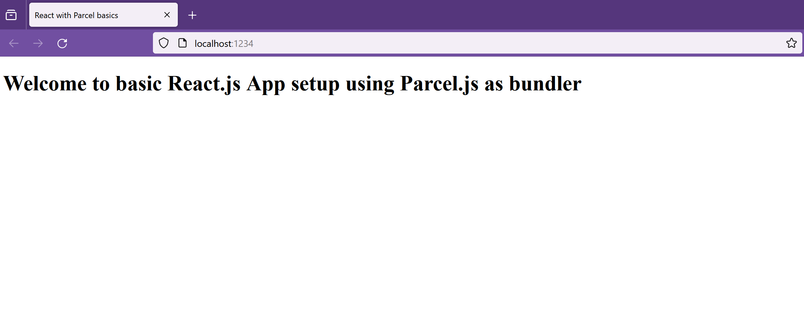

mkdir react-with-parcel
cd react-with-parcel
ls
npm init

fill details on prompt in CLI:
package name: (react-with-parcel)
version: (1.0.0)
description: react with parcel basic setup
entry point: (index.js)
test command: jest
git repository:
keywords: react, parcel, setup
author: Avinash Wadhawan
license: (ISC)
press ^C anytime to quit

code .

npm install react react-dom
npm install -D parcel
touch index.html
touch App.js

open your index.html & type html:5 then press enter; this will provide a basic html setup for you

in the body of the HTML page update by this:
	

now in App.js add these below lines of code:

import React from "react";
import ReactDOM from "react-dom";

const App = () => {
    return (
        <>
            <h1>Welcome to basic React.js App setup using Parcel.js as bundler</h1>
        </>
    )
}

const root = ReactDOM.createRoot(document.getElementById("root"));

root.render(root);

modify package.json file with below code:
  "scripts": {
    "start": "parcel index.html",
    "build": "parcel build index.html",
    "test": "jest"
  },

touch .gitignore
touch Readme.md

now we're ready to launch our react app using parcel by using below command:

npm run start

http://localhost:1234/

